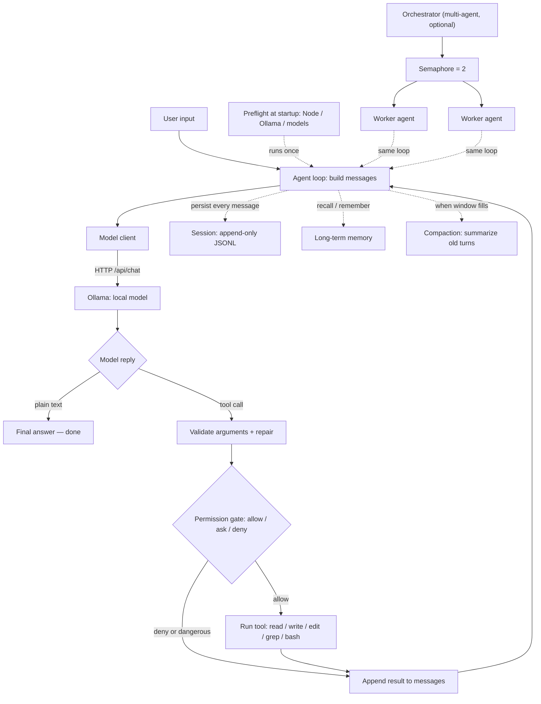

# Third-Party Notices & Design Notes

This document records (1) the project's third-party dependencies, (2) the reasoning
behind the technology choices, (3) the architecture, (4) the project layout, and
(5) the techniques it builds on — credited to the research papers and open-source
projects that document them — with a diagram of how it really works.

---

## 1. Third-party dependencies — none

This project has **zero third-party runtime or build dependencies**. It uses only
the **Node.js standard library** (e.g. `node:fs`, `node:path`, `node:os`,
`node:crypto`, `node:child_process`, `node:readline`, the global `fetch`, and the
built-in `node:test` runner).

Because nothing is vendored or installed from a package registry, there are no
external licenses to reproduce here. The only external software you supply yourself
is the **Node.js runtime** (its own license applies) and **Ollama** plus whatever
local models you choose to run (their respective licenses apply). This project does
not redistribute any of them.

If a dependency is ever added in the future, it will be listed here with its license,
and reviewed first (see `CONTRIBUTING.md`).

---

## 2. Why TypeScript on Node.js (the research behind the choice)

The language and runtime were chosen deliberately, after evaluating the trade-offs:

- **No compiler / no build step.** Modern Node.js can execute TypeScript directly by
  stripping the type annotations at load time (`--experimental-strip-types`, and on
  by default in newer releases). You clone the repository and run it — there is no
  transpile step, no bundler, and no generated `dist/` to keep in sync. This keeps
  the contributor workflow tiny and removes a whole class of build/version drift.
- **Types without a toolchain.** You still get the documentation and safety of types
  in the editor, but the types impose **zero runtime cost** and require **no extra
  package** to run.
- **Batteries-included standard library.** Node ships everything this project needs:
  an HTTP client (`fetch`), a test runner (`node:test`), filesystem, child-process,
  readline, and crypto. That made the **zero-dependency** goal achievable, which in
  turn shrinks the security and licensing surface to nearly nothing.
- **One language, end to end.** The CLI, the agent loop, the tools, and the tests are
  all in a single language, which lowers the barrier to reading and contributing.
- **First-class async I/O.** Streaming model output and running a small, bounded pool
  of concurrent agents map naturally onto JavaScript's event loop and promises.
- **Cross-platform.** The same source runs on Windows, macOS, and Linux without
  platform-specific build configuration.

Alternatives such as Python were considered (it is popular in the local-LLM space),
but Node's no-build TypeScript execution plus its standard-library HTTP/test tooling
made the zero-dependency, no-build-step design simpler to achieve here.

---

## 3. Architecture — how it really works

The harness is a small set of single-responsibility modules under `src/`. Each layer
is independent and depends only on the layer below it, so any one piece can be read,
tested, or replaced on its own.

**The request lifecycle (the agent loop).** A user message becomes a list of messages
sent to the model. The model replies with either plain text (the answer — the loop
ends) or one or more *tool calls*. For each tool call the harness validates the
arguments, asks the permission layer whether it is allowed, runs it if so, and feeds
the result back as a new message. This repeats until the model produces a final answer
or a guard stops it (a maximum-turn cap, or a circuit breaker after repeated denials).
This read → decide → act → observe cycle is the standard shape of a tool-using agent.

### Data-flow diagram



<details>
<summary>Plain-text version of the diagram</summary>

```
                 [Preflight: Node / Ollama / models]  (once at startup)
                                  |
   User input ───► Agent loop ───► Model client ──HTTP /api/chat──► Ollama (local)
                       ▲                                               |
                       |                                          model reply
                       |                                         /          \
                       |                                  plain text       tool call
                       |                                      |                |
                       |                                  final answer    validate args
                       |                                    (done)            |
                       |                                            Permission gate
                       |                                          (allow / ask / deny;
                       |                                           dangerous = blocked)
                       |                                         /                 \
                       |                                      allow                deny
                       |                                        |                   |
                       |                                  run tool             (skipped)
                       |                                (read/write/edit/         |
                       |                                 grep/bash)               |
                       └──────────── append result ◄───────────┴─────────────────┘

   side channels off the loop:  Session (append-only JSONL) · Long-term memory ·
                                Compaction (when the context window fills)

   multi-agent (optional):  Orchestrator ─► Semaphore(2) ─► Worker agents
                            (each worker runs the SAME agent loop, one level deep)
```
</details>

### Modules and responsibilities

| Module | Responsibility | Why separated |
|---|---|---|
| `config` | Model registry + which model/settings are active | One source of truth; lets models be switched or loaded from a file |
| `ollamaClient` | The only code that speaks the model's wire format | A single seam to swap the model backend without touching the loop |
| `tools` | The tool interface, a registry, and built-in file/search tools | Capabilities are data the model is offered, not hard-coded calls |
| `permissions` | An allow / ask / deny gate, plus a dangerous-command floor | Safety is enforced in one place, on every action |
| `agent` | The turn loop, argument validation/repair, loop guards | The orchestration logic, independent of any specific tool or model |
| `gate` | A small async semaphore | Bounds how many model generations run at once |
| `orchestrator` | A coordinator that delegates subtasks to worker agents | Multi-agent work reuses the same single-agent loop, one level deep |
| `session` | Append-only transcript persistence + resume | Durability without a database; replay is trivial |
| `memory` | Durable facts across separate conversations | Long-term recall, kept separate from a single session |
| `compaction` | Summarize older turns as the context window fills | Keeps long runs inside small local context windows |
| `preflight` | One-time startup checks with fix-it guidance | Fail clearly instead of crashing when prerequisites are missing |

### Design principles that shaped the structure

- **Safety lives at the leaf.** Every concrete action (a file write, a shell command)
  passes the permission gate, and a small set of clearly destructive commands is
  always blocked. Higher layers don't get to bypass it.
- **One swappable model seam.** Only one module knows the model's wire format, so the
  backend can change without rewriting the loop or the tools.
- **Tools are data, not branches.** Tools are registered objects with a JSON schema;
  the loop never hard-codes a particular tool, so adding a capability doesn't change
  the loop.
- **Defensive defaults for small/local models.** Argument validation with repair,
  recovery of tool calls that arrive in the wrong shape, bounded retries, and
  automatic context compaction all exist because local models need more scaffolding
  than large hosted ones.
- **Append-only state.** Sessions and memory are plain append-only files, which are
  crash-safe and resumable without any database.

These are widely used patterns in agent frameworks and command-line tools; none of
them is unique to this project.

---

## 4. Project layout

```
qwen-harness/
├── src/                        # harness source (TypeScript, run directly by Node) — grouped by feature
│   ├── cli/                    # entry + startup
│   │   ├── main.ts             # CLI entry (REPL + one-shot)
│   │   ├── loadEnv.ts          # zero-dep .env loader
│   │   └── preflight.ts        # one-time startup prerequisite checks
│   ├── model/                  # model backend + registry
│   │   ├── ollamaClient.ts     # the model wire-format seam (chat + streaming)
│   │   └── config.ts           # model registry + selection (builtin / file toggle)
│   ├── agent/                  # the turn loop
│   │   ├── agent.ts            # the single-agent turn loop
│   │   └── toolCallRecovery.ts # recover malformed / content-embedded tool calls
│   ├── tools/                  # tool interface + built-ins
│   │   └── tools.ts            # Tool interface, registry, read/grep/write/edit/multi_edit/bash
│   ├── permissions/            # safety
│   │   └── permissions.ts      # allow / ask / deny gate + dangerous-command floor
│   ├── orchestration/          # multi-agent + concurrency
│   │   ├── orchestrator.ts     # multi-agent coordinator + worker delegation
│   │   └── gate.ts             # async semaphore (concurrency cap)
│   └── state/                  # persistence + context
│       ├── session.ts          # append-only transcript persistence + resume
│       ├── memory.ts           # long-term remember / recall
│       └── compaction.ts       # context-window compaction
├── tests/                      # node:test suites (no model required)
├── scripts/                    # live smoke test against a real model
├── package.json                # zero dependencies
├── tsconfig.json
├── .env.example                # documents optional config (no secrets)
├── models.example.json         # template for user-defined models
├── README.md
├── USER-GUIDE.md
├── CONTRIBUTING.md
├── THIRD_PARTY_NOTICES.md
└── LICENSE
```

---

## 5. Techniques & prior art (credits & references)

This harness implements **well-established, openly-published agent techniques**. None of them
is unique to this project — each is documented in peer-reviewed / preprint research and
implemented across many open-source projects. We credit those foundations here, with thanks.

> **Licensing note:** every open-source project listed below is under a **permissive license
> (MIT or Apache-2.0) — free to use and modify**. Copyleft (e.g. AGPL) and proprietary
> projects are intentionally omitted from this list.

### Foundational research (papers)
- **Agent loop (reason → act → observe):** ReAct — Yao et al., ICLR 2023 — <https://arxiv.org/abs/2210.03629>
- **Tool / function calling:** Toolformer — Schick et al., NeurIPS 2023 — <https://arxiv.org/abs/2302.04761> · Gorilla — <https://arxiv.org/abs/2305.15334> · ToolLLM — <https://arxiv.org/abs/2307.16789>
- **Planning / decomposition:** Chain-of-Thought — <https://arxiv.org/abs/2201.11903> · Least-to-Most — <https://arxiv.org/abs/2205.10625> · Plan-and-Solve — <https://arxiv.org/abs/2305.04091>
- **Context management / compaction:** MemGPT — Packer et al. — <https://arxiv.org/abs/2310.08560>
- **Long-term memory (recency × importance × relevance):** Generative Agents — Park et al., UIST 2023 — <https://arxiv.org/abs/2304.03442> · RAG — Lewis et al., NeurIPS 2020 — <https://arxiv.org/abs/2005.11401>
- **Multi-agent orchestration:** AutoGen — <https://arxiv.org/abs/2308.08155> · MetaGPT — <https://arxiv.org/abs/2308.00352> · CAMEL — <https://arxiv.org/abs/2303.17760>
- **Reflection / verification (for the planned verify step):** Reflexion — <https://arxiv.org/abs/2303.11366> · Self-Refine — <https://arxiv.org/abs/2303.17651> · CRITIC — <https://arxiv.org/abs/2305.11738> · LLM-as-a-Judge — <https://arxiv.org/abs/2306.05685>
- **Reliable tool use on small/local models (act, don't narrate):** ReAct (above) · CodeAct — executable code actions — <https://arxiv.org/abs/2402.01030> · Berkeley Function-Calling Leaderboard (BFCL) — <https://gorilla.cs.berkeley.edu/leaderboard.html>
- **Agent loop / no-progress detection (stop a stuck model):** Overthinking/cyclic-tool loops — <https://arxiv.org/abs/2602.14798> · Repetition in production — <https://arxiv.org/abs/2512.04419>

### Similar open-source projects (permissive — MIT / Apache-2.0)
| Technique in this project | Representative open-source projects (license) |
|---|---|
| Exact-string `edit_file` + read-before-edit | [Aider](https://github.com/Aider-AI/aider) (Apache-2.0) · [OpenHands](https://github.com/OpenHands/OpenHands) (MIT) · [SWE-agent](https://github.com/SWE-agent/SWE-agent) (MIT) · [RA.Aid](https://github.com/ai-christianson/RA.Aid) (Apache-2.0) |
| Line-numbered file reading (`cat -n` style) | [OpenHands](https://github.com/OpenHands/OpenHands) (MIT) · [SWE-agent](https://github.com/SWE-agent/SWE-agent) (MIT) · [gptme](https://github.com/gptme/gptme) (MIT) |
| `multi_edit` (batch edits) | [Continue](https://github.com/continuedev/continue) (Apache-2.0 — has a `MultiEdit` tool) · [Cline](https://github.com/cline/cline) (Apache-2.0) |
| Permission allow / ask / deny + modes | [Cline](https://github.com/cline/cline) (Apache-2.0) · [Continue](https://github.com/continuedev/continue) (Apache-2.0 — `allow/ask/exclude`) |
| Tool-call recovery for local models | [Goose](https://github.com/block/goose) (Apache-2.0 — Ollama tool shim) · [gptme](https://github.com/gptme/gptme) (MIT) |
| "Act, don't narrate" prompt + idle no-action nudge + reasoning-token strip | [smolagents](https://github.com/huggingface/smolagents) (Apache-2.0) · [OpenHands](https://github.com/OpenHands/OpenHands) (MIT) · [Aider](https://github.com/Aider-AI/aider) (Apache-2.0) · [Roo-Code](https://github.com/RooCodeInc/Roo-Code) (Apache-2.0) · [LangGraph](https://github.com/langchain-ai/langgraph) (MIT) · [Qwen-Agent](https://github.com/QwenLM/Qwen-Agent) (Apache-2.0) |
| Loop / repeated-action detection (fingerprint tool+args; stop a stuck model) | [OpenHands](https://github.com/OpenHands/OpenHands) (MIT — `StuckDetector`) · [LangGraph](https://github.com/langchain-ai/langgraph) (MIT — `recursion_limit`) · [Deer-Flow](https://github.com/bytedance/deer-flow) (Apache-2.0 — loop middleware) |
| Safe read-only shell-command classification (allowlist + reject shell metacharacters; "reject, don't escape") | [OWASP Command Injection](https://owasp.org/www-community/attacks/Command_Injection) · [PortSwigger Web Security Academy](https://portswigger.net/web-security/os-command-injection) |
| File-finding (glob) tool + glob→regex matching | [Continue](https://github.com/continuedev/continue) (Apache-2.0 — `globSearch`) · [Roo-Code](https://github.com/RooCodeInc/Roo-Code) (Apache-2.0 — `list_files`) · [picomatch](https://github.com/micromatch/picomatch) / [minimatch](https://github.com/isaacs/minimatch) (MIT — glob→regex technique) |
| PowerShell tool + read-only-cmdlet classification (script-block / arbitrary-code → ask) + per-OS shell selection | [Microsoft PowerShell documentation](https://learn.microsoft.com/en-us/powershell/) (read-only `Get-*` cmdlets, `Get-Counter`; avoid `Invoke-Expression`) |
| Approve-and-remember — persisted "always allow" rules so the auto-approve set grows per-user | [Goose](https://github.com/block/goose) (Apache-2.0 — tool permission modes) · [Aider](https://github.com/Aider-AI/aider) (Apache-2.0 — config allow rules) · [OWASP AI Agent Security Cheat Sheet](https://cheatsheetseries.owasp.org/cheatsheets/AI_Agent_Security_Cheat_Sheet.html) |
| Context compaction (keep tail + summarize) | [LangChain](https://github.com/langchain-ai/langchain) (MIT) · [LlamaIndex](https://github.com/run-llama/llama_index) (MIT) · [Letta / MemGPT](https://github.com/letta-ai/letta) (Apache-2.0) |
| Long-term memory injection | [mem0](https://github.com/mem0ai/mem0) (Apache-2.0) · [Letta](https://github.com/letta-ai/letta) (Apache-2.0) |
| Session persistence (append-only transcript + resume) | [Plandex](https://github.com/plandex-ai/plandex) (MIT) · [Cline](https://github.com/cline/cline) (Apache-2.0) |
| Orchestrator → workers + concurrency cap | [AutoGen](https://github.com/microsoft/autogen) (MIT) · [CrewAI](https://github.com/crewAIInc/crewAI) (MIT) · [LangGraph](https://github.com/langchain-ai/langgraph) (MIT) · [CAMEL](https://github.com/camel-ai/camel) (Apache-2.0) |
| Verifier / judge (planned) | [FastChat `llm_judge`](https://github.com/lm-sys/FastChat) (Apache-2.0) · [Reflexion](https://github.com/noahshinn/reflexion) (MIT) |

With thanks to the authors and maintainers of the projects above. If you maintain one of these
and would like the credit adjusted, please open an issue.

---

## Contact

Questions, bug reports, or feature requests:

>
> **Open an issue:** https://github.com/Sachin7456/ollama-local-coding-agent/issues
